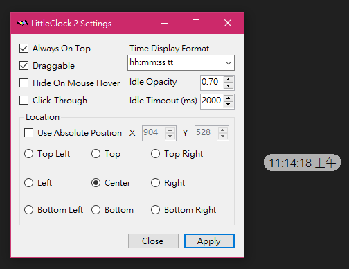

# Little Clock 2

Simple, small, lightweight Desktop Clock for Windows - rewrite version with bugfixs and new feature

# Features

- Click-throughable (i.e. doesn't block mouse click)
- Hide the clock on mouse hover
- Support transparent
- Fully customizable looking (e.g. colors, font, size)
- Portable settings file
  - Multiple clock with different settings!

# Portable Settings

The settings file is stored at `%AppData%\LittleClock2` directory by default. To enable portable settings (e.g. for multiple clock with different settings), create an empty file with name `LittleClock2_Settings.json` next to the LittleClock exe file.